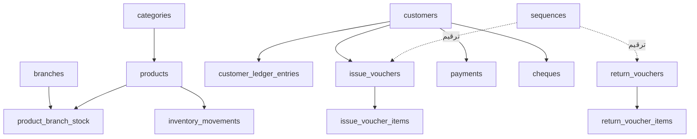

# Laravel Inventory Management System# 🏪 نظام إدارة المخزون والحسابات

## نظام إدارة المخزون

نظام متكامل لإدارة مخزون ومبيعات وحسابات محل أدوات كهربائية مع 3 فروع (المصنع، العتبة، إمبابة).

نظام متكامل لإدارة المخزون والمبيعات مع دعم كامل للغة العربية.

[](https://laravel.com)

---[](https://php.net)

[]()

## 📁 هيكل المشروع

---

### الملفات الأساسية

```## 📋 المحتويات

inventory-system/

├── app/                      # تطبيق Laravel الرئيسي- [المميزات](#-المميزات)

│   ├── Http/Controllers/     # المتحكمات- [المتطلبات](#-المتطلبات)

│   ├── Models/              # النماذج- [التنصيب السريع](#-التنصيب-السريع)

│   └── Services/            # الخدمات- [الاستخدام](#-الاستخدام)

├── database/                # قواعد البيانات والهجرات- [البنية](#-البنية)

│   ├── migrations/          # ملفات الهجرة- [التقارير](#-التقارير)

│   └── seeders/            # بيانات تجريبية- [الوثائق](#-الوثائق)

├── resources/               # الموارد والواجهات

│   ├── views/              # ملفات Blade---

│   └── css/js/            # ملفات الأنماط والسكريبت

├── routes/                  # ملفات التوجيه## ✨ المميزات

├── public/                  # الملفات العامة

└── storage/                 # التخزين والسجلات### 🏢 إدارة الفروع والمنتجات

```- ✅ **3 فروع**: المصنع، العتبة، إمبابة

- ✅ **كارت صنف موحد**: SKU، الاسم، الماركة، التصنيف، حجم العبوة، الحد الأدنى

### المجلدات المنظمة- ✅ **ربط المنتج بالفروع** مع تحديد الحد الأدنى والرصيد الحالي لكل فرع

- ✅ **تصنيفات قابلة للتوسع**: لمبات، ليدات، أدوات كهربائية...

#### 📜 `/scripts` - السكريبتات المساعدة

```### 📦 إدارة المخزون المتقدمة

scripts/- ✅ **ترقيم متسلسل بدون فجوات**:

├── bat/        # ملفات Batch (.bat) - أدوات التطوير  - إذن صرف: `1 → 999,999`

├── ps1/        # ملفات PowerShell (.ps1) - سكريبتات الإصلاح  - إذن ارتجاع: `100,001 → 125,000`

└── php/        # سكريبتات PHP المساعدة  - إذن تحويل: `1 → 999,999`

```- ✅ **منع الرصيد السالب 100%** عبر Database Transactions

- ✅ **أنواع الحركات**:

#### 📚 `/docs` - التوثيق  - `ADD`: إضافة للمخزون (افتتاحي أو توريد)

```  - `ISSUE`: صرف (بيع أو تحويل)

docs/  - `RETURN`: ارتجاع من عميل

├── tasks/      # ملفات المهام المكتملة (TASK-*.md)  - `TRANSFER_OUT` / `TRANSFER_IN`: تحويل بين فروع

├── archived/   # التقارير القديمة والأرشيف- ✅ **تنبيهات ذكية**:

└── ...         # توثيق عام  - حد أدنى للمخزون لكل صنف/فرع

```  - تحقق من كسر العبوة/الكرتونة (تنبيه فقط، لا منع)


### الملفات الرئيسية في الجذر### 🧾 أذون الصرف والارتجاع

#### إذن صرف (Issue Voucher)

| الملف | الوصف |- **نوعان**: بيع `SALE` أو تحويل `TRANSFER`

|------|-------|- **إدخال مرن**: بالوحدة أو الكرتونة

| `SYSTEM-OVERVIEW.md` | نظرة عامة على النظام |- **خصومات ذكية**: على مستوى البند أو الفاتورة (% أو مبلغ ثابت)

| `PROJECT-STATUS.md` | حالة المشروع الحالية |- **نوع الدفع**: نقدي `CASH` أو آجل `CREDIT`

| `DATABASE-CONTENT.md` | توثيق قاعدة البيانات |- **دورة العمل**:

| `DEPLOYMENT-GUIDE.md` | دليل النشر |  1. إنشاء مسودة `DRAFT` (لا تأثير على المخزون)

| `SETUP.md` | دليل التثبيت والإعداد |  2. اعتماد `APPROVED`:

| `CHANGELOG.md` | سجل التغييرات |     - إسناد رقم تسلسلي تلقائياً

| `CODE-REVIEW-REPORT.md` | تقرير مراجعة الكود |     - خصم المخزون مع منع الرصيد السالب

     - إضافة قيد دفتر عميل (إن كان بيع آجل)

---     - إنشاء إذن استلام تلقائي (إن كان تحويل بين فروع)

- **طباعة PDF**: متاحة فقط بعد الاعتماد

## 🚀 البدء السريع

#### إذن ارتجاع (Return Voucher)

### المتطلبات- **ترقيم خاص**: `100,001 → 125,000` بدون فجوات

- PHP 8.2+- **الاعتماد**: إضافة للمخزون + قيد دائن (له) للعميل

- Composer

- Node.js & NPM### 👥 إدارة العملاء الشاملة

- SQLite (تطوير) أو MySQL (إنتاج)- ✅ **دفتر حسابات** بنظام علية (مدين) / له (دائن)

- ✅ **الرصيد المتحرك** لكل حركة

### التثبيت- ✅ **فلاتر ذكية**:

```bash  - حسب الحالة: نشط / غير نشط

# 1. تثبيت الاعتماديات  - حسب نوع الرصيد: دائن / مدين / متزن

composer install- ✅ **تصنيف تلقائي**: عملاء غير نشطين (افتراضي: 12 شهر)

npm install- ✅ **كشف حساب PDF** مع رصيد متحرك وتوقيعات


# 2. إعداد البيئة### 💰 المدفوعات والشيكات

cp .env.example .env- ✅ **تسجيل مدفوعات**: نقدية أو بشيك

php artisan key:generate- ✅ **إدارة شيكات متقدمة**:

  - حالات: معلق `PENDING` / محصّل `CLEARED` / مرتجع `RETURNED`

# 3. إعداد قاعدة البيانات  - ربط الشيك بفاتورة صرف

php artisan migrate --seed  - تحديد بنك وتاريخ استحقاق

- ✅ **جرد الشيكات** غير المصروفة

# 4. بناء الأصول- ✅ **تنبيهات**:

npm run build  - شيكات مستحقة قريباً (7 أيام)

  - شيكات متأخرة عن الموعد

# 5. تشغيل الخادم

php artisan serve --port=8001### 📊 التقارير الشاملة

```1. **إجمالي المخزون**:

   - فلاتر: فرع، تصنيف، منتج، أقل من الحد الأدنى

الآن افتح المتصفح على: `http://127.0.0.1:8001`   - تصدير: CSV، PDF (A4 Landscape)

   

---2. **حركة صنف**: سجل كامل لكل حركات منتج في فترة محددة


## 📊 الوحدات الرئيسية3. **أرصدة العملاء**: قائمة شاملة بكل العملاء مع:

   - الرصيد الحالي

### ✅ مكتملة 100%   - عدد الفواتير

- 🏢 **إدارة الفروع** - إضافة وتعديل فروع المخزن   - عدد المرتجعات

- 📦 **إدارة المنتجات** - كتالوج كامل للمنتجات   - آخر نشاط

- 📂 **إدارة التصنيفات** - تنظيم المنتجات

- 👥 **إدارة العملاء** - بيانات وحسابات العملاء4. **العملاء غير النشطين**: عملاء لم يشتروا منذ N شهر (قابل للتعديل)

- 📋 **أذون الصرف** - صرف المنتجات للعملاء

- 🔄 **أذون الإرجاع** - إرجاع المنتجات للمخزن5. **كشف حساب عميل PDF**: طباعة احترافية مع:

- 💰 **المدفوعات** - تسجيل المدفوعات (نقدي/شيك)   - جدول الحركات (تاريخ، بيان، علية، له، رصيد متحرك)

- 💳 **إدارة الشيكات** - متابعة الشيكات (معلق/صرف/إرجاع)   - إحصائيات (إجمالي علية، إجمالي له، الرصيد النهائي)

- 📊 **التقارير الشاملة**:   - صندوق توقيعات (المحاسب، المدير المالي، العميل)

  - تقرير المخزون الشامل

  - تقرير نقص المخزون### 📥 استيراد من Excel/CSV

  - حركة المنتجات#### 1. استيراد الأصناف والأرصدة الافتتاحية

  - أرصدة العملاء- **قالب CSV**: `branch_code, sku, qty_units`

  - كشف حساب العميل- **تحقق**: صحة الفرع، المنتج، الكمية

  - العملاء غير النشطين- **تنفيذ**: تطبيق على المخزون عبر `InventoryService`

- 📥 **الاستيراد/التصدير** - Excel, CSV

- 🖨️ **طباعة PDF** - أذون + تقارير احترافية#### 2. استيراد العملاء والأرصدة

- **قالب**: `customer_code, name, phone, address, opening_balance`

---- **تنفيذ**: إنشاء عميل + قيد افتتاحي تلقائي


## 🔐 المستخدمون والصلاحيات#### 3. استيراد الشيكات

- **قالب**: `customer_code, cheque_number, bank, due_date, amount`

### المستخدم الافتراضي- **حالة افتراضية**: `PENDING`

```

Email: admin@inventory.test### 🎯 لوحة المتابعة (Dashboard)

Password: password#### إحصائيات أساسية

```- عدد الفروع النشطة

- عدد التصنيفات

---- عدد المنتجات النشطة

- إجمالي قيمة المخزون

## 🗄️ قاعدة البيانات

#### Widgets الذكية

### الجداول الرئيسية (15 جدول)1. **أعلى 10 أصناف أقل من الحد الأدنى** (مرتبة بالنقص الأكبر)

- `branches` - الفروع2. **أصناف نفذت من المخزون** (رصيد = 0)

- `categories` - التصنيفات3. **شيكات مستحقة قريباً** (خلال 7 أيام)

- `products` - المنتجات4. **شيكات متأخرة** (Overdue)

- `product_branch_stock` - مخزون المنتجات بالفروع5. **أكثر 10 أصناف حركة** (الشهر الحالي)

- `customers` - العملاء6. **آخر 10 أذون معتمدة**

- `issue_vouchers` + `issue_voucher_items` - أذون الصرف

- `return_vouchers` + `return_voucher_items` - أذون الإرجاع### 🖨️ طباعة PDF احترافية

- `payments` - المدفوعات- ✅ **قوالب A4 عربية RTL** مع خط DejaVu Sans

- `cheques` - الشيكات- ✅ **قوالب متاحة**:

- `ledger_entries` - سجل حسابات العملاء  - إذن صرف (Portrait)

- `inventory_movements` - حركات المخزون  - إذن ارتجاع (Portrait)

  - كشف حساب عميل (Portrait مع رصيد متحرك)

راجع `DATABASE-CONTENT.md` للتفاصيل الكاملة.  - تقرير إجمالي المخزون (Landscape)

- ✅ **تصدير CSV** لكل التقارير

---

---

## 🛠️ التطوير

## 🔧 المتطلبات

### الأوامر المفيدة

```bash### متطلبات النظام

# تشغيل الاختبارات```

php artisan testPHP >= 8.2

Composer >= 2.0

# مسح الذاكرة المؤقتةSQLite (افتراضي) أو MySQL/PostgreSQL

php artisan optimize:clear```


# إنشاء بيانات تجريبية### PHP Extensions المطلوبة

php artisan db:seed```

- php-sqlite3 (إذا استخدمت SQLite)

# عرض المسارات- php-mbstring

php artisan route:list- php-xml

```- php-gd

- php-zip

### السكريبتات المساعدة```

```powershell

# تنظيف الكاش الكامل### الحزم الرئيسية

.\scripts\bat\clear_all_cache.bat| حزمة | إصدار | الغرض |

|------|--------|-------|

# إنشاء بيانات تجريبية| Laravel | 12.32.5 | Framework |

.\scripts\bat\quick_test_data.bat| DomPDF | ^2.0 | تصدير PDF |

```| Spatie Permission | 6.21 | الصلاحيات |

| Spatie Activity Log | 4.10 | التدقيق |

---| Bootstrap | 5.3 RTL | واجهة المستخدم |


## 📝 التقنيات المستخدمة---


### Backend## 🚀 التنصيب السريع

- **Framework:** Laravel 12.32.5

- **PHP:** 8.2+### 1. استنساخ المشروع

- **Database:** SQLite (dev) / MySQL (prod)```bash

git clone <repository-url>

### Frontendcd inventory-system

- **CSS Framework:** Bootstrap 5.3 RTL```

- **Icons:** Bootstrap Icons

- **JavaScript:** Vanilla JS + Alpine.js (optional)### 2. تثبيت الاعتماديات

```bash

### Librariescomposer install

- **PDF Generation:** DomPDF```

- **Excel:** Laravel Excel / PhpSpreadsheet

- **Activity Log:** Spatie Activity Log### 3. إعداد البيئة

- **Permissions:** Spatie Permission (optional)```bash

# نسخ ملف .env

---copy .env.example .env


## 🎯 المميزات الرئيسية# توليد مفتاح التطبيق

php artisan key:generate

✅ **دعم كامل للغة العربية** - واجهة RTL كاملة  ```

✅ **إدارة متعددة الفروع** - مخزون مستقل لكل فرع  

✅ **نظام شيكات متكامل** - متابعة دقيقة للشيكات  ### 4. إعداد قاعدة البيانات

✅ **تقارير شاملة** - PDF + Excel  

✅ **سجل نشاط** - تتبع جميع العمليات  #### SQLite (افتراضي - مُوصى به للتطوير)

✅ **استيراد/تصدير** - Excel, CSV  في `.env`:

✅ **طباعة احترافية** - أذون وتقارير  ```env

✅ **واجهة حديثة** - Bootstrap 5.3  DB_CONNECTION=sqlite

✅ **متجاوب** - يعمل على جميع الأجهزة  # سيتم إنشاء database/database.sqlite تلقائياً

```

---

#### MySQL (للإنتاج)

## 📞 التوثيق الإضافيفي `.env`:

```env

- 📖 **نظرة عامة:** `SYSTEM-OVERVIEW.md`DB_CONNECTION=mysql

- 🚀 **دليل النشر:** `DEPLOYMENT-GUIDE.md`DB_HOST=127.0.0.1

- 📋 **المهام المكتملة:** `docs/tasks/`DB_PORT=3306

- 🔧 **دليل الإعداد:** `SETUP.md`DB_DATABASE=inventory_system

DB_USERNAME=root

---DB_PASSWORD=your_password

```

## 📊 حالة المشروع

### 5. تشغيل Migrations

| المعيار | الحالة |```bash

|---------|--------|# إنشاء الجداول (16 table)

| **التطوير** | ✅ مكتمل 100% |php artisan migrate

| **الاختبار** | ✅ تم الاختبار |

| **التوثيق** | ✅ كامل |# (اختياري) إدخال بيانات تجريبية

| **الجاهزية** | ✅ جاهز للإنتاج |php artisan db:seed

```

**الإصدار:** 1.0.0  

**آخر تحديث:** أكتوبر 2025### 6. تشغيل السيرفر

```bash

---php artisan serve

```

## 🎯 الخطوات التالية

🎉 **افتح المتصفح**: `http://127.0.0.1:8000`

راجع `NEXT-STEPS.md` للتوصيات والتطويرات المستقبلية.

---

---

## 📖 الاستخدام

**الترخيص:** MIT  

**لغة البرمجة:** PHP 8.2+  ### 🏁 البداية السريعة

**Framework:** Laravel 12

#### 1. إعداد الفروع والتصنيفات
```
1. الفروع: /branches (معدة مسبقاً: المصنع، العتبة، إمبابة)
2. التصنيفات: /categories → أضف (لمبات، ليدات، أدوات...)
```

#### 2. إضافة المنتجات
```
/products/create → املأ:
  - SKU (فريد)
  - الاسم
  - الماركة
  - التصنيف
  - حجم العبوة (اختياري)
  - الحد الأدنى
```

#### 3. استيراد الأرصدة الافتتاحية
```
/imports → تبويب "استيراد المنتجات"
  - تحميل قالب CSV
  - املأ: branch_code, sku, qty_units
  - رفع → معاينة → تنفيذ
```

#### 4. إضافة العملاء
```
/customers/create → أو استيراد من CSV
```

#### 5. إنشاء إذن صرف
```
/issue-vouchers/create:
  1. اختر نوع: بيع أو تحويل
  2. اختر عميل (إن بيع) أو فرع (إن تحويل)
  3. اختر نوع دفع: نقدي أو آجل
  4. أضف البنود
  5. احفظ كمسودة → اعتمد → طباعة PDF
```

### 📊 عرض التقارير
| تقرير | رابط | فلاتر |
|-------|------|--------|
| إجمالي المخزون | `/reports/inventory` | فرع، تصنيف، منتج، أقل من حد أدنى |
| حركة صنف | `/reports/product-movement` | منتج، فترة |
| أرصدة العملاء | `/reports/customer-balances` | نوع رصيد، نشط/غير نشط |
| عملاء غير نشطين | `/reports/inactive-customers` | عدد الأشهر |
| كشف حساب | زر في `/customers/{id}` | فترة (اختياري) |

---

## 📁 البنية

```
inventory-system/
├── app/
│   ├── Http/Controllers/
│   │   ├── DashboardController.php    (7 widgets)
│   │   ├── BranchController.php
│   │   ├── CategoryController.php
│   │   ├── ProductController.php
│   │   ├── CustomerController.php
│   │   ├── IssueVoucherController.php (مسودة → اعتماد)
│   │   ├── ReturnVoucherController.php
│   │   ├── PaymentController.php
│   │   ├── ChequeController.php
│   │   ├── ImportController.php       (CSV: منتجات، عملاء، شيكات)
│   │   └── ReportController.php       (7 reports)
│   ├── Models/                        (14 models)
│   ├── Services/
│   │   ├── SequencerService.php       (ترقيم متسلسل)
│   │   └── InventoryService.php       (حركات مخزون)
│   └── Imports/                       (3 CSV importers)
├── database/
│   ├── migrations/                    (16 migrations)
│   └── database.sqlite
├── resources/views/
│   ├── layouts/app.blade.php          (RTL Bootstrap)
│   ├── dashboard.blade.php            (7 widgets)
│   ├── [10+ modules]/
│   ├── imports/                       (3-tab interface)
│   └── reports/                       (6 reports + 3 PDF templates)
└── routes/web.php                     (65+ routes)
```

### قاعدة البيانات (16 جدول)


---

## 📊 التقارير

### 1. إجمالي المخزون
```
المسار: /reports/inventory
الفلاتر:
  - فرع
  - تصنيف
  - منتج
  - أقل من الحد الأدنى
التصدير: CSV, PDF (Landscape)
المحتوى:
  - SKU، الاسم، الفرع، الرصيد الحالي، الحد الأدنى
  - ألوان: أخضر (عادي)، أصفر (أقل من الحد)، أحمر (نفذ)
  - إحصائيات: إجمالي الأصناف، الكميات، تحت الحد، نفذت
```

### 2. حركة صنف
```
المسار: /reports/product-movement
الفلاتر:
  - منتج (مطلوب)
  - فرع
  - فترة (من - إلى)
المحتوى:
  - التاريخ، نوع الحركة، الكمية، المرجع
  - Badges ملونة: ADD (أخضر), ISSUE (أحمر), RETURN (أزرق)
```

### 3. أرصدة العملاء
```
المسار: /reports/customer-balances
الفلاتر:
  - نوع الرصيد (دائن/مدين/متزن)
  - نشط/غير نشط
المحتوى:
  - كود، اسم، رصيد، عدد فواتير، عدد مرتجعات
  - إحصائيات: إجمالي عملاء، إجمالي علية، إجمالي له، صافي الرصيد
```

### 4. العملاء غير النشطين
```
المسار: /reports/inactive-customers
الفلاتر:
  - عدد الأشهر (افتراضي: 12)
المحتوى:
  - اسم، آخر نشاط (منذ X)، الرصيد الحالي
```

### 5. كشف حساب عميل PDF
```
المسار: زر "تصدير PDF" في /customers/{id}
الفلاتر:
  - فترة (اختياري)
المحتوى:
  - رأس: بيانات عميل
  - صندوق ملخص: إجمالي علية، له، الرصيد النهائي
  - جدول: تاريخ، بيان، علية، له، رصيد متحرك
  - توقيعات: محاسب، مدير مالي، عميل
```

---

## 🔒 الأمان

### حماية CSRF
- كل النماذج محمية بـ `@csrf` token
- التحقق التلقائي في Laravel Middleware

### Validation صارمة
```php
// مثال: IssueVoucher
'qty_units' => 'required|integer|min:1',
'unit_price' => 'required|numeric|min:0',
'discount_value' => 'nullable|numeric|min:0',
```

### منع SQL Injection
- استخدام **Eloquent ORM** حصرياً
- Prepared Statements تلقائياً

### منع الرصيد السالب
```php
DB::transaction(function() use ($voucher) {
    // 1. التحقق من الرصيد
    if ($currentStock < $qty) {
        throw new Exception('رصيد غير كافٍ');
    }
    // 2. خصم المخزون
    InventoryService::applyMovement('ISSUE', ...);
    // 3. قيد العميل
    // إن فشلت أي خطوة → ROLLBACK
});
```

---

## 🐛 استكشاف الأخطاء

### ❌ "Could not find driver"
**الحل**:
```bash
# في php.ini:
extension=pdo_sqlite
extension=sqlite3
# ثم أعد تشغيل PHP
```

### ❌ "Class 'DomPDF' not found"
**الحل**:
```bash
composer require barryvdh/laravel-dompdf
```

### ❌ "Permission denied" في database.sqlite
**الحل** (Linux/Mac):
```bash
chmod 777 database/
chmod 666 database/database.sqlite
```

### ❌ CSV لا يعرض العربية
**الحل**:
- احفظ CSV بصيغة **UTF-8 with BOM**
- استخدم Excel أو LibreOffice Calc
- تأكد من وجود BOM في أول الملف

### ❌ "Sequence out of range"
**الحل**:
```bash
# فحص جدول sequences
php artisan tinker
>>> App\Models\Sequence::all();
# تأكد من أن current_value < max_value
```

---

## 📚 الوثائق الكاملة

| ملف | الوصف |
|-----|-------|
| [BACKLOG.md](BACKLOG.md) | 36 Task مفصلة مع Acceptance Criteria |
| [API-CONTRACT.md](API-CONTRACT.md) | توثيق كامل لكل Routes والـ Controllers |
| [PLAN.md](PLAN.md) | خطة المشروع والمراحل |
| [TEST-CASES.md](TEST-CASES.md) | حالات اختبار Unit/Integration/E2E |
| [QA-CHECKLIST.md](QA-CHECKLIST.md) | قائمة مراجعة الجودة |
| [MIGRATIONS-ORDER.md](MIGRATIONS-ORDER.md) | ترتيب Migrations والاعتماديات |

---

## 🎯 الحالة الحالية

### ✅ مكتمل 100% (TASK-001 إلى TASK-025)

#### البنية الأساسية
- [x] Laravel 12 + PHP 8.2 + SQLite
- [x] قاعدة البيانات (16 tables)
- [x] Bootstrap 5 RTL
- [x] DomPDF

#### الميزات الأساسية
- [x] إدارة الفروع (3 فروع)
- [x] إدارة التصنيفات والمنتجات
- [x] ربط المنتج بالفروع
- [x] ترقيم متسلسل (SequencerService)
- [x] حركات المخزون (InventoryService)
- [x] منع الرصيد السالب

#### أذون الصرف والارتجاع
- [x] إذن صرف (مسودة → اعتماد)
- [x] إذن ارتجاع (ترقيم 100001-125000)
- [x] تحويل بين فروع
- [x] خصومات (بند + فاتورة)
- [x] طباعة PDF

#### إدارة العملاء
- [x] دفتر حسابات (علية/له)
- [x] رصيد متحرك
- [x] كشف حساب PDF

#### المدفوعات والشيكات
- [x] تسجيل مدفوعات
- [x] إدارة شيكات (3 حالات)
- [x] جرد شيكات
- [x] تنبيهات استحقاق

#### التنبيهات
- [x] حد أدنى للمخزون
- [x] كسر العبوة
- [x] شيكات مستحقة/متأخرة

#### طباعة PDF
- [x] إذن صرف (3 قوالب)
- [x] إذن ارتجاع
- [x] كشف حساب عميل
- [x] تقرير مخزون (Landscape)

#### استيراد CSV
- [x] استيراد منتجات وأرصدة
- [x] استيراد عملاء
- [x] استيراد شيكات

#### التقارير
- [x] إجمالي المخزون (CSV + PDF)
- [x] حركة صنف
- [x] أرصدة العملاء
- [x] عملاء غير نشطين
- [x] كشف حساب PDF

#### لوحة المتابعة
- [x] 7 Widgets ذكية
- [x] إحصائيات مباشرة
- [x] روابط سريعة

### ⏳ قيد التطوير (TASK-026 إلى TASK-036)
- [ ] نظام الأدوار والصلاحيات (Policies)
- [ ] سجل التدقيق (Activity Log)
- [ ] فلاتر متقدمة
- [ ] بحث فوري (AJAX)
- [ ] واجهة موبايل Responsive
- [ ] Unit Tests
- [ ] Integration Tests
- [ ] E2E Tests
- [ ] UAT
- [ ] توثيق API كامل
- [ ] دليل النشر Hostinger

---

## 📊 إحصائيات المشروع

```
📂 Files Created:         120+
📝 Lines of Code:         15,000+
🎯 Features:              25 مكتملة
📊 Reports:               5
📥 Import Types:          3
🖨️ PDF Templates:         4
🗄️ Database Tables:       16
🔀 Routes:                65+
🎨 Views:                 45+
⚙️ Services:              2 (Sequencer, Inventory)
📦 Models:                14
```

---

## 🚀 الخطوات التالية

1. **TASK-026-027**: تطبيق نظام الصلاحيات + Activity Log
2. **TASK-028-030**: ميزات متقدمة (فلاتر، بحث، responsive)
3. **TASK-031-034**: اختبارات شاملة (Unit, Integration, E2E, UAT)
4. **TASK-035**: توثيق API كامل
5. **TASK-036**: النشر على Hostinger

---

## 📞 الدعم

للدعم والاستفسارات:
- **الوثائق**: راجع ملفات `.md` في المشروع
- **API**: [API-CONTRACT.md](API-CONTRACT.md)
- **الاختبارات**: [TEST-CASES.md](TEST-CASES.md)

---

## 📄 الترخيص

هذا المشروع مخصص لمحل أدوات كهربائية. جميع الحقوق محفوظة © 2025

---

<div align="center">

**تم التطوير بـ ❤️ باستخدام Laravel 12 + Bootstrap 5 RTL**


**نظام إدارة مخزون احترافي | المصنع - العتبة - إمبابة**

</div>
