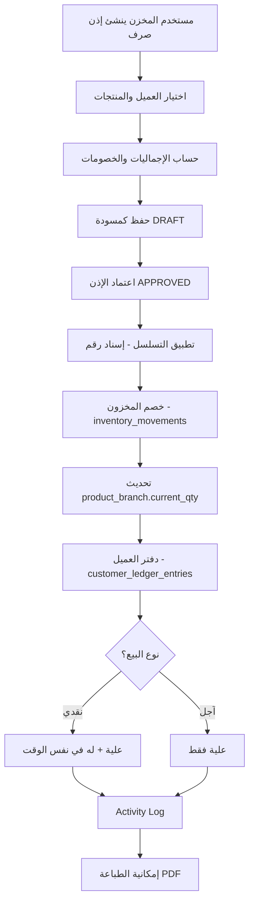
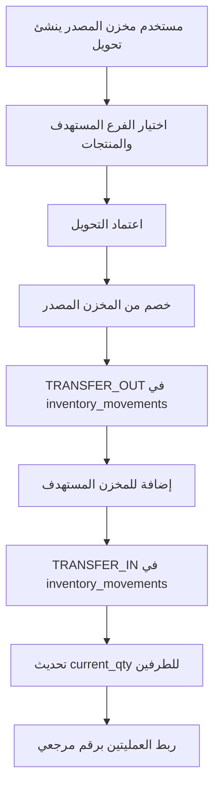
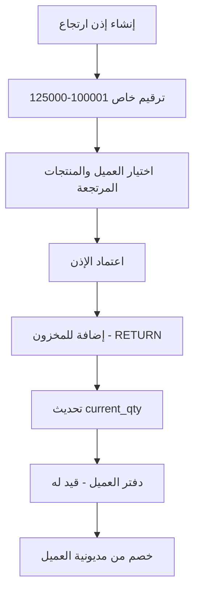
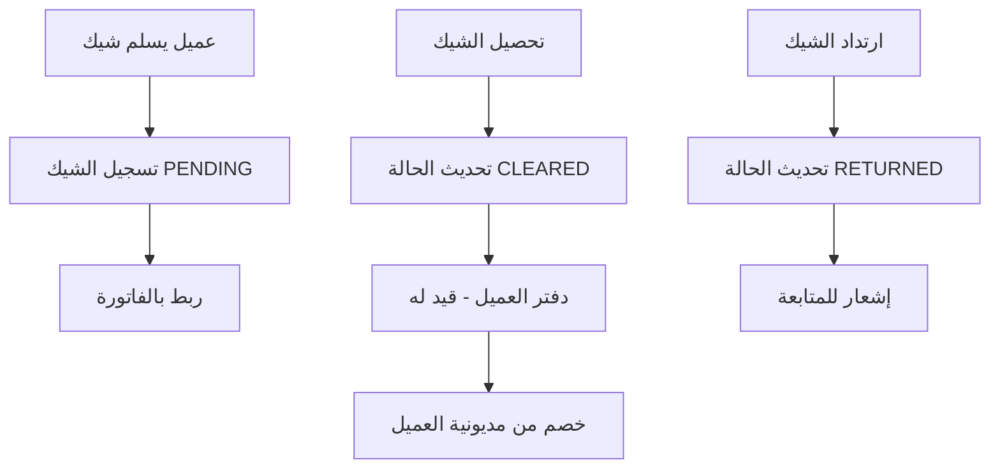
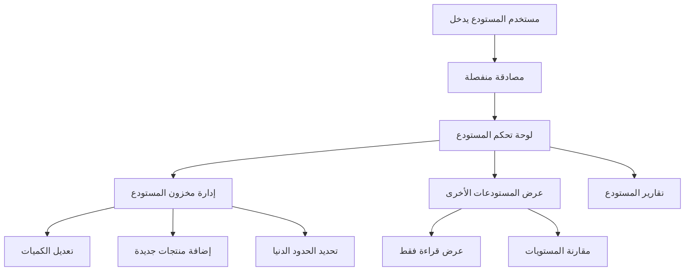

# 🔄 Data Flow & System Architecture
## تدفق البيانات والمعمارية الشاملة - نظام إدارة المخزون

**تاريخ الإنشاء:** 14 أكتوبر 2025  
**آخر تحديث:** 14 أكتوبر 2025  
**الحالة:** وثيقة مرجعية شاملة

---

## 🏢 نظرة عامة على النظام

### الكيانات الأساسية:
- **3 مخازن رئيسية:** المصنع، العتبة، إمبابة
- **3 أنواع مستخدمين:** المخزن، المدير، الحسابات  
- **4 أنواع عمليات أساسية:** إضافة، صرف، ارتجاع، تحويل
- **نظامين منفصلين:** النظام الأساسي + نظام إدارة المستودعات

---

## 🗂️ هيكل البيانات الأساسي (Database Schema)

### الجداول الرئيسية:

```sql
-- الكيانات المرجعية
branches (id, code, name, is_active)
users (id, name, email, password, branch_id, role)  
customers (id, code, name, phone, address, is_active, last_activity_at)
products (id, sku, name, brand, category_id, unit, pack_size, min_qty_default, is_active)
categories (id, name)

-- ربط المنتجات بالفروع (مع الرصيد المتحرك)
product_branch (
    product_id, 
    branch_id, 
    current_qty,      -- الرصيد الحالي (محسوب تلقائياً)
    min_qty,          -- الحد الأدنى للفرع
    created_at, updated_at
)

-- التسلسل والترقيم
sequences (
    document_type ENUM['ISSUE','RETURN','TRANSFER'], 
    current_value, 
    min_value, 
    max_value, 
    step
)

-- أذون الصرف (بيع/تحويل)
issue_vouchers (
    id, 
    number,                    -- الرقم المسلسل (يُطبق عند الاعتماد)
    branch_source_id,          -- الفرع المصدر
    issue_type ENUM['SALE','TRANSFER'],
    customer_id,               -- العميل (للبيع) أو null (للتحويل)
    target_branch_id,          -- الفرع المستهدف (للتحويل)
    status ENUM['DRAFT','APPROVED'],
    payment_type ENUM['CASH','CREDIT'], 
    discount_type ENUM['NONE','PERCENT','AMOUNT'],
    discount_value,
    total_before,              -- الإجمالي قبل الخصم
    total_discount,            -- إجمالي الخصم
    total_after,               -- الصافي بعد الخصم
    notes,
    created_by, approved_by, approved_at,
    created_at, updated_at
)

-- بنود أذون الصرف
issue_voucher_lines (
    id, issue_voucher_id, product_id,
    qty_units,                 -- الكمية بالوحدة
    unit_price,               -- سعر الوحدة
    line_discount_type ENUM['NONE','PERCENT','AMOUNT'],
    line_discount_value,      -- خصم البند
    line_total,               -- صافي البند
    created_at, updated_at
)

-- أذون الارتجاع (100001-125000)
return_vouchers (
    id, 
    number,                   -- من 100001 إلى 125000
    branch_target_id,         -- الفرع المستقبل
    customer_id,              -- العميل أو null
    status ENUM['DRAFT','APPROVED'],
    reason,                   -- سبب الارتجاع
    total_before, total_discount, total_after,
    created_by, approved_by, approved_at,
    created_at, updated_at
)

-- بنود أذون الارتجاع
return_voucher_lines (
    id, return_voucher_id, product_id,
    qty_units, unit_price,
    line_discount_type, line_discount_value, line_total,
    created_at, updated_at
)

-- حركات المخزون (سجل تفصيلي لكل حركة)
inventory_movements (
    id, branch_id, product_id,
    movement_type ENUM['ADD','ISSUE','RETURN','TRANSFER_OUT','TRANSFER_IN'],
    qty_units,                -- الكمية (+ أو -)
    unit_price_snapshot,      -- سعر وقت الحركة
    ref_table,                -- نوع المستند المرتبط
    ref_id,                   -- رقم المستند
    notes,
    created_at
)

-- دفتر العملاء (علية/له)
customer_ledger_entries (
    id, customer_id, date, description,
    debit_aliah,              -- علية (المبلغ على العميل)
    credit_lah,               -- له (المبلغ للعميل)
    ref_table, ref_id,        -- المستند المرتبط
    created_at
)

-- المدفوعات
payments (
    id, customer_id, amount, 
    method ENUM['CASH','CHEQUE'],
    cheque_id,                -- رقم الشيك إن وجد
    date, notes,
    ref_issue_voucher_id,     -- الفاتورة المرتبطة
    created_at, updated_at
)

-- الشيكات
cheques (
    id, customer_id, cheque_number, bank, due_date, amount,
    status ENUM['PENDING','CLEARED','RETURNED'],
    linked_issue_voucher_id,  -- الفاتورة المرتبطة
    cleared_at,
    created_at, updated_at
)

-- سجل التدقيق
activity_log (
    id, user_id, action, model_type, model_id,
    old_values, new_values, ip_address,
    created_at
)
```

---

## 🔐 الأدوار والصلاحيات (RBAC)

### الأدوار الثلاثة:

#### 1️⃣ مستخدم المخزن (Store User)
```yaml
الصلاحيات:
  المخزون:
    - تعديل: فرعه فقط ✅
    - عرض: جميع الفروع (قراءة فقط) 👀
  
  أذون الصرف:
    - إنشاء: من فرعه فقط ✅
    - اعتماد: من فرعه فقط ✅
    - عرض: فرعه + الأذون المحولة إليه 👀
  
  أذون الارتجاع:
    - إنشاء: لفرعه فقط ✅
    - اعتماد: لفرعه فقط ✅
    - عرض: فرعه + الأذون المرتجعة منه 👀
  
  التحويلات:
    - إنشاء تحويل: من فرعه إلى فرع آخر ✅
    - استقبال تحويل: لفرعه من فرع آخر ✅
  
  المنع:
    - تعديل بيانات الفروع الأخرى ❌
    - عرض/تعديل دفاتر العملاء ❌
    - إدارة المدفوعات والشيكات ❌

الربط: users.branch_id = المخزن المخصص
```

#### 2️⃣ المدير (Manager) 
```yaml
الصلاحيات:
  شاملة: جميع العمليات على جميع الفروع ✅✅✅
  
  إضافية:
    - تقارير مجمعة عبر جميع الفروع ✅
    - إدارة المستخدمين والأدوار ✅
    - تعديل إعدادات النظام ✅
    - Activity Log كامل ✅
    - النسخ الاحتياطي والاستعادة ✅

الربط: users.branch_id = null (غير مرتبط بفرع محدد)
```

#### 3️⃣ الحسابات (Accounting)
```yaml
الصلاحيات:
  المالية:
    - دفاتر العملاء: عرض/تعديل جميع الفروع ✅
    - المدفوعات: إنشاء/تعديل جميع الفروع ✅
    - الشيكات: إدارة كاملة جميع الفروع ✅
    - كشوف الحساب: طباعة/تصدير ✅
  
  المخزون:
    - عرض فقط: جميع الفروع 👀
    - التقارير: قراءة تقارير المخزون 👀
  
  المنع:
    - تعديل المخزون أو الأذون ❌
    - إنشاء/اعتماد أذون صرف/ارتجاع ❌

الربط: users.branch_id = null (وصول مالي شامل)
```

---

## 🌊 تدفق البيانات الأساسي (Core Data Flows)

### 1️⃣ عملية البيع (Issue Voucher - SALE)



**التفاصيل التقنية:**
```sql
-- خطوات الاعتماد داخل Transaction
BEGIN TRANSACTION;

-- 1. إسناد الرقم المتسلسل
UPDATE sequences 
SET current_value = current_value + 1 
WHERE document_type = 'ISSUE';

-- 2. تحديث رقم الإذن
UPDATE issue_vouchers 
SET number = (SELECT current_value FROM sequences WHERE document_type = 'ISSUE'),
    status = 'APPROVED', approved_by = ?, approved_at = NOW()
WHERE id = ?;

-- 3. خصم المخزون لكل بند
INSERT INTO inventory_movements (branch_id, product_id, movement_type, qty_units, ref_table, ref_id)
SELECT ?, product_id, 'ISSUE', -qty_units, 'issue_vouchers', ?
FROM issue_voucher_lines WHERE issue_voucher_id = ?;

-- 4. تحديث الرصيد المتحرك
UPDATE product_branch pb 
SET current_qty = current_qty - (
    SELECT SUM(qty_units) FROM issue_voucher_lines 
    WHERE issue_voucher_id = ? AND product_id = pb.product_id
)
WHERE branch_id = ?;

-- 5. دفتر العميل
INSERT INTO customer_ledger_entries (customer_id, date, description, debit_aliah, credit_lah, ref_table, ref_id)
VALUES (?, NOW(), CONCAT('فاتورة رقم ', voucher_number), total_after, 
        CASE WHEN payment_type = 'CASH' THEN total_after ELSE 0 END, 
        'issue_vouchers', ?);

COMMIT;
```

### 2️⃣ التحويل بين المخازن (Issue Voucher - TRANSFER)



**التفاصيل التقنية:**
```sql
-- عملية التحويل (داخل Transaction واحدة)
BEGIN TRANSACTION;

-- 1. خصم من المصدر
INSERT INTO inventory_movements 
(branch_id, product_id, movement_type, qty_units, ref_table, ref_id, notes)
VALUES (source_branch_id, product_id, 'TRANSFER_OUT', -qty, 'issue_vouchers', voucher_id, 
        CONCAT('تحويل إلى فرع ', target_branch_name));

-- 2. إضافة للمستهدف  
INSERT INTO inventory_movements 
(branch_id, product_id, movement_type, qty_units, ref_table, ref_id, notes)
VALUES (target_branch_id, product_id, 'TRANSFER_IN', +qty, 'issue_vouchers', voucher_id,
        CONCAT('تحويل من فرع ', source_branch_name));

-- 3. تحديث الأرصدة
UPDATE product_branch SET current_qty = current_qty - qty 
WHERE branch_id = source_branch_id AND product_id = product_id;

UPDATE product_branch SET current_qty = current_qty + qty 
WHERE branch_id = target_branch_id AND product_id = product_id;

COMMIT;
```

### 3️⃣ عملية الارتجاع (Return Voucher)



**التفاصيل التقنية:**
```sql
-- عملية الارتجاع
BEGIN TRANSACTION;

-- 1. ترقيم خاص للارتجاع (100001-125000)
UPDATE sequences 
SET current_value = current_value + 1 
WHERE document_type = 'RETURN' 
  AND current_value < max_value; -- التحقق من عدم تجاوز النطاق

-- 2. إضافة للمخزون
INSERT INTO inventory_movements 
(branch_id, product_id, movement_type, qty_units, ref_table, ref_id)
VALUES (branch_id, product_id, 'RETURN', +qty_units, 'return_vouchers', voucher_id);

-- 3. دفتر العميل (خصم من المديونية)
INSERT INTO customer_ledger_entries 
(customer_id, date, description, debit_aliah, credit_lah, ref_table, ref_id)
VALUES (customer_id, NOW(), CONCAT('ارتجاع رقم ', voucher_number), 
        0, total_after, 'return_vouchers', voucher_id);

COMMIT;
```

### 4️⃣ إدارة الشيكات والمدفوعات



---

## 📊 الحسابات والمعادلات الأساسية

### 1️⃣ الرصيد المتحرك للمخزون:
```javascript
// لكل منتج في كل فرع
current_qty = Σ(ADD + RETURN + TRANSFER_IN) - Σ(ISSUE + TRANSFER_OUT)

// التحديث بعد كل حركة
new_balance = previous_balance + additions - deductions
```

### 2️⃣ الرصيد المتحرك للعميل:
```javascript
// دفتر العميل (علية/له)
customer_balance = Σ(debit_aliah) - Σ(credit_lah)

// علية = مبيعات آجلة (مديونية على العميل)
// له = مدفوعات + مرتجعات (خصم من المديونية)
```

### 3️⃣ حساب الخصومات:
```javascript
// خصم البند
line_total = (qty_units × unit_price) - line_discount

// خصم الفاتورة  
total_before = Σ(line_total)
total_after = total_before - header_discount

// أنواع الخصم: PERCENT أو AMOUNT
if (discount_type === 'PERCENT') {
    discount_amount = (value × discount_value) / 100
} else {
    discount_amount = discount_value
}
```

### 4️⃣ التحقق من حجم العبوة:
```javascript
// للأصناف التي لها pack_size
if (product.pack_size > 0) {
    remainder = qty_units % product.pack_size
    if (remainder !== 0) {
        show_warning("كسر عبوة: " + remainder + " قطعة زائدة")
        if (system_settings.enforce_full_pack) {
            prevent_save()
        }
    }
}
```

---

## 🔒 قواعد الحماية والتحقق

### 1️⃣ منع الرصيد السالب:
```sql
-- فحص قبل اعتماد أي مستند صرف
SELECT current_qty FROM product_branch 
WHERE branch_id = ? AND product_id = ?;

IF (current_qty < required_qty) THEN
    ROLLBACK;
    RAISE EXCEPTION 'المخزون غير كافي. الرصيد الحالي: %', current_qty;
END IF;
```

### 2️⃣ التسلسل بدون فجوات:
```sql
-- استخدام قفل للحماية من التضارب
SELECT current_value FROM sequences 
WHERE document_type = ? FOR UPDATE;

-- التحقق من النطاق (للارتجاع)
IF (document_type = 'RETURN' AND current_value >= 125000) THEN
    RAISE EXCEPTION 'تم استنفاد أرقام أذون الارتجاع';
END IF;
```

### 3️⃣ صلاحيات الفروع:
```php
// Policy للتحقق من صلاحية الفرع
public function viewAnyBranch(User $user)
{
    return $user->role === 'manager' || $user->role === 'accounting';
}

public function updateBranch(User $user, Branch $branch) 
{
    return $user->role === 'manager' || 
           ($user->role === 'store_user' && $user->branch_id === $branch->id);
}
```

---

## 📈 التقارير والاستعلامات الرئيسية

### 1️⃣ تقرير الإجمالي (أرصدة المخزون):
```sql
SELECT 
    p.sku, p.name, p.brand, c.name as category,
    pb.current_qty, pb.min_qty,
    CASE WHEN pb.current_qty <= pb.min_qty THEN 'منخفض' ELSE 'عادي' END as status,
    p.pack_size
FROM products p
JOIN product_branch pb ON p.id = pb.product_id  
JOIN categories c ON p.category_id = c.id
WHERE pb.branch_id = ?
ORDER BY status DESC, p.name;
```

### 2️⃣ حركة صنف مفصلة:
```sql
SELECT 
    im.created_at as date,
    im.movement_type,
    im.qty_units,
    im.notes,
    pb.current_qty as balance_after
FROM inventory_movements im
JOIN product_branch pb ON im.branch_id = pb.branch_id AND im.product_id = pb.product_id
WHERE im.branch_id = ? AND im.product_id = ?
ORDER BY im.created_at DESC;
```

### 3️⃣ أرصدة العملاء:
```sql
SELECT 
    c.name, c.code,
    SUM(cle.debit_aliah - cle.credit_lah) as balance,
    MAX(cle.created_at) as last_activity,
    COUNT(CASE WHEN cle.debit_aliah > 0 THEN 1 END) as purchase_count,
    COUNT(CASE WHEN cle.credit_lah > 0 THEN 1 END) as payment_count,
    CASE WHEN MAX(cle.created_at) < DATE_SUB(NOW(), INTERVAL 12 MONTH) 
         THEN 'غير نشط' ELSE 'نشط' END as activity_status
FROM customers c
LEFT JOIN customer_ledger_entries cle ON c.id = cle.customer_id
GROUP BY c.id, c.name, c.code
HAVING balance != 0 OR last_activity IS NOT NULL
ORDER BY balance DESC;
```

### 4️⃣ الشيكات المستحقة:
```sql
SELECT 
    c.name as customer_name,
    ch.cheque_number, ch.bank, ch.due_date, ch.amount,
    DATEDIFF(ch.due_date, CURDATE()) as days_remaining,
    iv.number as invoice_number
FROM cheques ch
JOIN customers c ON ch.customer_id = c.id
LEFT JOIN issue_vouchers iv ON ch.linked_issue_voucher_id = iv.id  
WHERE ch.status = 'PENDING'
  AND ch.due_date <= DATE_ADD(CURDATE(), INTERVAL 30 DAY)
ORDER BY ch.due_date ASC;
```

---

## 🏭 نظام إدارة المستودعات المنفصل

### الفصل الكامل:
```yaml
المصادقة:
  - مسار منفصل: /warehouse/login
  - جدول منفصل: warehouse_users
  - JWT tokens منفصلة: warehouse_tokens
  
الصلاحيات:
  المصنع:
    - إدارة كاملة: مخزون المصنع ✅
    - قراءة فقط: العتبة + إمبابة 👀
  
  العتبة:
    - إدارة كاملة: مخزون العتبة ✅  
    - قراءة فقط: المصنع + إمبابة 👀
  
  إمبابة:
    - إدارة كاملة: مخزون إمبابة ✅
    - قراءة فقط: المصنع + العتبة 👀

قاعدة البيانات:
  - نفس الجداول الأساسية
  - جداول إضافية للمستودعات:
    * warehouse_users
    * warehouse_sessions  
    * warehouse_settings
```

### تدفق البيانات في نظام المستودعات:


---

## ⚡ نقاط الأداء الحرجة

### 1️⃣ الفهارس المطلوبة:
```sql
-- فهارس الأداء
CREATE INDEX idx_inventory_movements_branch_product_date 
ON inventory_movements (branch_id, product_id, created_at);

CREATE INDEX idx_customer_ledger_customer_date 
ON customer_ledger_entries (customer_id, created_at);

CREATE INDEX idx_product_branch_branch_product 
ON product_branch (branch_id, product_id);

CREATE INDEX idx_issue_vouchers_branch_date 
ON issue_vouchers (branch_source_id, created_at);
```

### 2️⃣ التجميع المسبق (Caching):
```php
// تحديث الرصيد المتحرك بعد كل حركة
class InventoryService 
{
    public function updateRunningBalance($branchId, $productId, $qtyChange) 
    {
        DB::table('product_branch')
          ->where('branch_id', $branchId)
          ->where('product_id', $productId)  
          ->increment('current_qty', $qtyChange);
    }
}
```

### 3️⃣ تحسين الاستعلامات:
```sql
-- استعلام محسن لتقرير الإجمالي
SELECT p.*, pb.current_qty, pb.min_qty,
       CASE WHEN pb.current_qty <= pb.min_qty THEN 1 ELSE 0 END as is_low_stock
FROM products p 
INNER JOIN product_branch pb ON p.id = pb.product_id
WHERE pb.branch_id = ? AND p.is_active = 1
ORDER BY is_low_stock DESC, p.name
LIMIT 100;
```

---

## 🔄 خطة النسخ الاحتياطي والاستعادة

### النسخ اليومي:
```bash
#!/bin/bash
# daily_backup.sh

DATE=$(date +%Y%m%d_%H%M%S)
BACKUP_DIR="/backups/inventory_system"
DB_NAME="inventory_system"

# نسخة قاعدة البيانات
mysqldump -u $DB_USER -p$DB_PASS $DB_NAME > $BACKUP_DIR/db_backup_$DATE.sql

# ضغط الملف
gzip $BACKUP_DIR/db_backup_$DATE.sql

# حذف النسخ الأقدم من 30 يوم
find $BACKUP_DIR -name "db_backup_*.sql.gz" -mtime +30 -delete
```

### الاستعادة السريعة:
```php
class BackupService 
{
    public function createManualBackup() 
    {
        $filename = 'manual_backup_' . date('Ymd_His') . '.sql';
        
        $command = sprintf(
            'mysqldump -u %s -p%s %s > %s',
            env('DB_USERNAME'),
            env('DB_PASSWORD'), 
            env('DB_DATABASE'),
            storage_path('backups/' . $filename)
        );
        
        exec($command);
        return $filename;
    }
}
```

---

## 📋 خلاصة تدفق البيانات

### العمليات الأساسية:
1. **البيع:** مخزون ↓ → دفتر عميل (علية) → مدفوعات اختيارية (له)
2. **التحويل:** مخزون مصدر ↓ → مخزون مستهدف ↑  
3. **الارتجاع:** مخزون ↑ → دفتر عميل (له)
4. **الشيكات:** تسجيل → تحصيل → دفتر عميل (له)

### نقاط التحكم:
- **التسلسل:** بدون فجوات لجميع المستندات
- **الصلاحيات:** مرتبطة بالفرع ونوع المستخدم  
- **التحقق:** منع الرصيد السالب + فحص حجم العبوة
- **التدقيق:** تسجيل جميع العمليات الحساسة

### الهدف النهائي:
نظام متكامل يعيد إنتاج نفس النتائج الموجودة في ملفات Excel الحالية مع إضافة:
- **الأمان والصلاحيات**
- **التكامل بين المخازن** 
- **الحماية من التلاعب**
- **التقارير المتقدمة**
- **نظام مستودعات منفصل**

---

**آخر تحديث:** 14 أكتوبر 2025  
**المطور:** GitHub Copilot  
**المشروع:** نظام إدارة المخزون - Data Flow Architecture