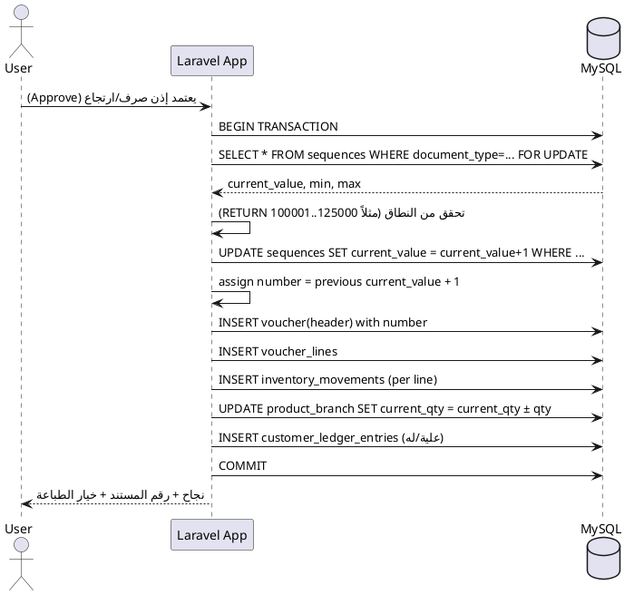
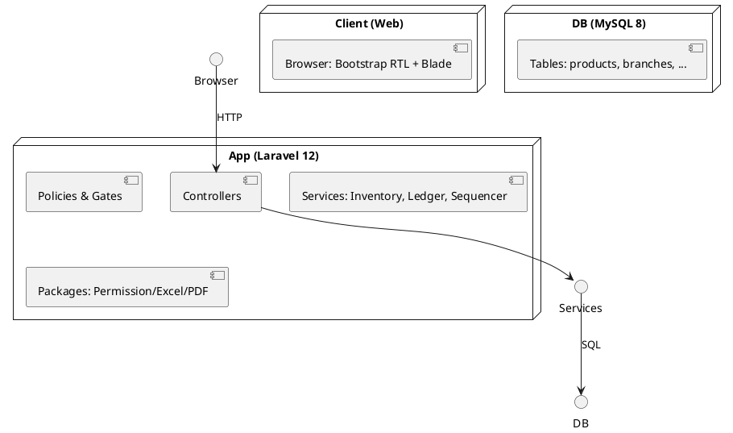
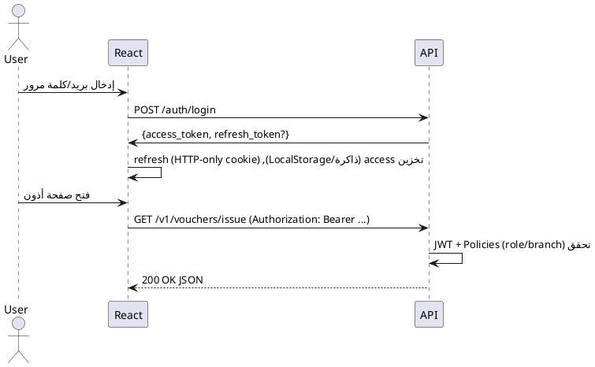

# SPEC-1-نظام إدارة مخزون/عملاء/حسابات لمحل أدوات كهربائية (3 مخازن)

## Background

- النشاط: محل أدوات كهربائية لديه 3 مخازن (المصنع، العتبة، إمبابة).
- الهدف: بناء نظام مخصص لإدارة المخزون، العملاء، والحسابات مع صلاحيات واضحة لثلاث فئات مستخدمين: المخزن، المدير، الحسابات.
- متطلبات الوصول: كل مخزن يمكنه تعديل بيانات مخزنه فقط، مع إمكانية **عرض** مخازن أخرى بدون تعديل.
- تجربة الاستخدام: واجهة منظمة وسهلة القراءة والاستخدام (UX واضحة)، لأن المستخدمين متنوعون في الخبرة التقنية.
- بيئة الاستضافة: **Hostinger Shared Hosting**، ما يفرض اختيار تقنيات متوافقة مع خطط الاستضافة المشتركة.
- أسلوب التطوير: سيتم توليد أجزاء من النظام أو ملفات المواصفات/الكود باستخدام Claude Sonnet 4 على VS Code مع مراجعة بشرية، لذا يجب أن تكون الملفات واضحة ومهيكلة ليقرأها AI بسهولة (تعليقات، README، سكريبتات إعداد، أمثلة بيانات).
- مدخلات لاحقة: سيتم تزويدي بملفات الحسابات وشرح التدفقات المحاسبية لاعتمادها ضمن التصميم النهائي.


## Requirements

### MoSCoW

**Must Have (ضروريات)**
- **إدارة مخزون متعددة الفروع** (المصنع/العتبة/إمبابة) مع صلاحيات: مستخدم المخزن يعدّل على فرعه فقط ويطّلع (قراءة فقط) على باقي الفروع. المدير صلاحيات كاملة. الحسابات صلاحيات مالية عبر كل الفروع + قراءة المخزون.
- **كارت صنف موحّد**: (SKU/كود، الاسم، الماركة، الفئة/التصنيف، وحدة القياس، *حجم العبوة/الكرتونة*، حالة التفعيل، حد أدنى لكل فرع).
- **حركات مخزنية**: إضافة/صرف/ارتجاع مع **رصيد متحرك** لكل صنف/فرع (running balance) وتتبّع المستخدم والتاريخ والمرجع.
- **تحويلات بين المخازن**: إذن تحويل واحد يخصم من المصدر ويضيف للمستلم مع الربط التلقائي بين القيدين.
- **أذون صرف (بيع/تحويل)**: بنود (اسم الصنف، الكمية، العبوة، سعر الوحدة، الإجمالي)، اختيار عميل/فرع، طباعة، وتحديث المخزون والقيود المالية تلقائيًا.
- **أذون ارتجاع**: ترقيم متسلسل **من 100001 إلى 125000** بلا فجوات، يؤثّر على المخزون و**دفتر العميل (له)**، مع سبب الارتجاع.
- **دفتر عملاء**: (تاريخ، بيان، علية، له، رصيد متحرك)، تقارير مركزية تجمع آخر رصيد/تاريخ آخر حركة/عدد المشتريات والمرتجعات، وطباعة كشف حساب/PDF.
- **جرد الشيكات غير المصروفة**: (العميل، رقم الشيك، البنك، تاريخ الاستحقاق، المبلغ، رقم الفاتورة)، وعند التحصيل يقفل في **دفتر العميل (له)** ويؤرشف.
- **تنبيهات حد أدنى للمخزون** لكل صنف/فرع وتقارير نقص المخزون.
- **التسلسل والترقيم** لكل نوع مستند (صرف/ارتجاع/تحويل) بدون تكرار أو حذف، مع **سجل تدقيق (Audit Log)** لمن أنشأ واعتمد.
- **طباعة القوالب** بصيغة قريبة من النماذج الحالية + **تصدير PDF**.
- **استيراد بيانات أولية من Excel** (الأصناف، الأرصدة الافتتاحية، العملاء، أرصدة العملاء، الشيكات).
- **توافق الاستضافة**: يعمل على **Hostinger Shared Hosting** (قاعدة بيانات مركزية، عدم الاعتماد على خدمات تتطلب صلاحيات سيرفر غير متاحة على الشيرد).

**Should Have (مهمّة)**
- تصنيف نشاط العميل (نشط/غير نشط) مع **إعداد فترة قابلة للتعديل** (افتراضي 12 شهرًا).
- فلاتر وتقارير متقدّمة (بالفترة/الفرع/الصنف/العميل) ولوحات متابعة مبسطة.
- التحقق من الكميات بالنسبة **لحجم العبوة/الكرتونة** مع تنبيه عند كسر العبوة.

**Could Have (تحسينية)**
- واجهة موبايل (Responsive) وتحميل جماعي للبنود.
- بحث فوري بالأكواد/الأسماء واقتراح تلقائي.
- تنبيهات بريدية لانخفاض المخزون (وفق إمكانيات الهوستينج).

**Won’t Have (خارج نطاق MVP)**
- تكاليف المخزون المتقدمة (FIFO/Weighted Average) وتقارير الربحية التفصيلية.
- تكاملات خارجية (بوابات دفع/فواتير إلكترونية) في النسخة الأولى.
- صلاحيات دقيقة جدًا على مستوى الحقول (نبدأ بدور/فرع/مستند).

### قيود واعتبارات
- **لغة وواجهة**: عربية كاملة، طباعة عربية سليمة.
- **الزمن**: Africa/Cairo للتواريخ.
- **الأمان**: أدوار وصلاحيات، تسجيل دخول، تتبع الجلسات، Audit Log.
- **القابلية للطباعة**: قوالب A4 لأذون الصرف/الارتجاع وكشوف الحساب.
- **الأداء**: دعم حتى ~10 آلاف صنف و~100 ألف حركة سنويًا على قاعدة واحدة.
- **القابلية للترحيل**: سكريبتات استيراد مكررة وآمنة من Excel.

### افتراضات (تُعدّل بناءً على تأكيدك)
- الأسعار تُخزَّن **للوحدة المفردة**، مع عامل تحويل للكرتونة.
- البيع قد يكون **نقدي** أو **آجل**؛ النقدي يُسجَّل «علية» ثم «له» فوريًا في نفس المستند لتصفية الرصيد.
- الحسابات تملك صلاحية الاطلاع على كل المخازن وتعديل القيود المالية فقط.


## Method

### التكنولوجيا والتهيئة (ملائمة Hostinger Shared)
- **Back-end**: Laravel **12.x** (PHP 8.2+)، متوافق ومُدعّم طويلًا.
- **DB**: MySQL 8.x.
- **Front-end/UX**: Blade + **Bootstrap 5.3 RTL** عبر CDN (بدون build خطوة)، جداول واضحة وطباعات A4.
- **الحِزم**:
  - أدوار وصلاحيات: `spatie/laravel-permission` (v6.x).
  - PDF للطباعة: `barryvdh/laravel-dompdf` (v3.x) مع خطوط عربية.
  - استيراد/تصدير Excel: `maatwebsite/excel` (^3.1).
  - سجلات تدقيق (اختياري): `spatie/laravel-activitylog`.
- **نشر على Hostinger**: مشروع Laravel داخل `public_html`, إعداد `.htaccess`, ربط قاعدة MySQL، Cron اختياري للتنبيهات (إن توفر).

### نموذج الصلاحيات والأدوار
- **المخزن (Store User)**: مرتبط بفرع واحد، **CRUD** على مستندات فرعه فقط، **قراءة فقط** لباقي الفروع.
- **الحسابات (Accounting)**: إدارة دفتر العملاء والمدفوعات/الشيكات عبر كل الفروع، قراءة حركة المخزون.
- **المدير (Manager)**: صلاحيات كاملة + تقارير مجمّعة.
- تطبيق الصلاحيات عبر **Policies** و**Gates** مع ربط المستخدم بـ `branch_id` عند التحقق.

### نمذجة البيانات (جداول أساسية)
> الأسماء مقترحة ويمكن تعديلها أثناء التنفيذ. المفاتيح الأساسية `id` تلقائية.

**الكيانات المرجعية**
- `branches` : (code, name, is_active)
- `users` : (name, email, password_hash, branch_id nullable)
- `customers` : (code, name, phone, address, is_active, last_activity_at)
- `products` : (sku, name, brand, category_id nullable, unit="pcs", pack_size INT nullable, min_qty_default INT nullable, is_active)
- `product_branch` : (product_id, branch_id, **min_qty**, **current_qty** (cache/تجميعي))
- `categories` : (name)

**الترقيم والتسلسل**
- `sequences` : (document_type ENUM['ISSUE','RETURN','TRANSFER'], **current_value**, **min_value**, **max_value**, step=1)
  - RETURN مضبوط: min=100001, max=125000.

**مستندات البيع/الصرف والتحويل**
- `issue_vouchers` :
  - الأعمدة: (number UNIQUE nullable حتى الاعتماد, branch_source_id, **issue_type ENUM['SALE','TRANSFER']**, customer_id nullable, target_branch_id nullable, status ENUM['DRAFT','APPROVED'], **discount_type ENUM['NONE','PERCENT','AMOUNT']**, **discount_value DEC(12,2)**, **total_before DEC(12,2)**, **total_discount DEC(12,2)**, **total_after DEC(12,2)**, payment_type ENUM['CASH','CREDIT'], notes, created_by, approved_by, approved_at, created_at)
- `issue_voucher_lines` : (issue_voucher_id, product_id, **qty_units INT**, unit_price DEC(12,2), **line_discount_type ENUM['NONE','PERCENT','AMOUNT']**, **line_discount_value DEC(12,2)**, **line_total DEC(12,2)**)

**مستندات الارتجاع**
- `return_vouchers` : (number **UNIQUE** ضمن النطاق، branch_target_id, customer_id nullable, status, **reason**, totals مثل أعلاه، created_by/approved_by/at)
- `return_voucher_lines` : (return_voucher_id, product_id, qty_units, unit_price, line_discount_*, line_total)

**الحركات المخزنية (سجل تفصيلي)**
- `inventory_movements` : (branch_id, product_id, **movement_type ENUM['ADD','ISSUE','RETURN','TRANSFER_OUT','TRANSFER_IN']**, **qty_units INT**, unit_price_snapshot DEC(12,2) nullable، **ref_table** + **ref_id**، notes، created_at)
  - فهارس: (branch_id, product_id, created_at), (ref_table, ref_id).
- **تجميعي سريع**: `product_branch.current_qty` يُحدَّث بعد اعتماد المستند لتسريع التقارير.

**دفتر العملاء والمدفوعات والشيكات**
- `customer_ledger_entries` : (customer_id, date, description, **debit_aliah DEC(12,2)**, **credit_lah DEC(12,2)**, **ref_table/ref_id**, created_at)
  - الرصيد = مجموع(debit) - مجموع(credit). يمكن حسابه استعلامًا أو حفظه دوريًا cache.
- `payments` : (customer_id, amount, **method ENUM['CASH','CHEQUE']**, **cheque_id nullable**, date, notes, ref_issue_voucher_id nullable)
- `cheques` : (customer_id, cheque_number, bank, **due_date DATE**, amount, **status ENUM['PENDING','CLEARED','RETURNED']**, linked_issue_voucher_id nullable, cleared_at nullable)

**السجل والتدقيق** (اختياري)
- `activity_log` عبر الحزمة لتسجيل: أنشأ/اعتمد/طبع مع IP ووقت.

### قواعد العمل والمعادلات
- **Running Balance (المخزون)** لكل (product, branch):
  `current_qty = Σ(ADD + RETURN + TRANSFER_IN) - Σ(ISSUE + TRANSFER_OUT)`
- **Running Balance (العملاء)**: رصيد العميل = Σ(علية) - Σ(له).
- **الأسعار والخصومات**:
  - سعر الحفظ **للوحدة**. إدخال الكرتونة اختياري في الواجهة ويحوَّل إلى وحدات: `qty_units = cartons * pack_size + units`.
  - **خصم** على مستوى **البند** وعلى مستوى **الفاتورة**، بنوعين (٪ أو مبلغ ثابت). الصافي:
    `line_total = qty_units * unit_price - line_discount`
    `total_after = Σ(line_total) - header_discount`
- **الأذون بدون فجوات**:
  - الترقيم يُسند **عند الاعتماد فقط** داخل معاملة **Transaction** على جدول `sequences` (قراءة بقفل `FOR UPDATE` ثم زيادة وحفظ الرقم)، لتجنّب فقد أرقام عند إلغاء المسودات.
- **تحويل مخزني**: إنشاء **Issue (TRANSFER)** من المصدر يقابله **TRANSFER_IN** للمستلم تلقائيًا، برقم مرجعي متبادل.
- **الحد الأدنى**: تنبيه إذا `current_qty < min_qty` للفرع/الصنف.
- **العبوة/الكرتونة**: **السماح بكسر العبوة** مع **تنبيه** للمستخدم (إعداد قابل للتغيير).
- **الرصيد السالب**: **منع تام** لاعتماد أي مستند يؤدي إلى رصيد سالب.

### إعدادات النظام (System Settings)
- `opening_balance_date = 2025-01-01`  ← **تاريخ متعارف عليه** كبداية تشغيل.
- `enforce_full_pack = false`  ← السماح بكسر العبوة مع تنبيه.
- `prevent_negative_stock = true`  ← حظر اعتماد يُسبب رصيدًا سالبًا.
- `inactive_customer_months = 12` (قابل للتعديل من الإعدادات).
- `return_sequence_range = 100001..125000`.
- `timezone = Africa/Cairo`, `locale = ar`.

### تدفقات اعتماد المستندات (Sequence)


### تخطيط المكوّنات (Component)


### مخطط بيانات مبسّط (ER/Class)
```plantuml
@startuml
class Branch {id; code; name}
class Product {id; sku; name; pack_size; min_qty_default}
class ProductBranch {product_id; branch_id; current_qty; min_qty}
class Customer {id; code; name}
class IssueVoucher {id; number; branch_source_id; issue_type; customer_id; status; total_after}
class IssueVoucherLine {id; issue_voucher_id; product_id; qty_units; unit_price; line_total}
class ReturnVoucher {id; number; branch_target_id; customer_id; status; total_after}
class ReturnVoucherLine {id; return_voucher_id; product_id; qty_units; unit_price; line_total}
class InventoryMovement {id; branch_id; product_id; movement_type; qty_units; ref_table; ref_id}
class CustomerLedgerEntry {id; customer_id; date; debit_aliah; credit_lah; ref_table; ref_id}
class Sequence {document_type; current_value; min_value; max_value}

ProductBranch "*" -- "1" Product
ProductBranch "*" -- "1" Branch
IssueVoucher "1" -- "*" IssueVoucherLine
ReturnVoucher "1" -- "*" ReturnVoucherLine
InventoryMovement ..> IssueVoucher
InventoryMovement ..> ReturnVoucher
CustomerLedgerEntry ..> IssueVoucher
CustomerLedgerEntry ..> ReturnVoucher
IssueVoucher "*" -- "1" Branch : source
IssueVoucher "*" -- "0..1" Customer
ReturnVoucher "*" -- "0..1" Customer
Sequence ..> IssueVoucher
Sequence ..> ReturnVoucher
@enduml
```

### واجهات الاستخدام (ملخص سريع)
- **لوحة رئيسية**: تنبيهات حد أدنى، أكثر 10 أصناف حركةً، آخر أذون معتمَدة.
- **أذون**: نماذج سريعة بإدخال (كرتونة/وحدة)، خصم بند/فاتورة، طباعة A4 عربية.
- **جرد وتقارير**: حركة صنف، مقارنة جرد فعلي، تقرير إجمالي أرصدة العملاء ونشاطهم، تقرير الشيكات غير المصروفة.
- **قابلية القراءة**: جداول برؤوس ثابتة، ألوان هادئة، RTL، اختصارات لوحة مفاتيح أساسية.


## Implementation

### 1) الإعداد السريع (Hostinger Shared)
- **Laravel 12 + PHP 8.2**، Timezone: `Africa/Cairo`، Locale: `ar`.
- تنصيب الحِزم:
  ```bash
  composer require spatie/laravel-permission:^6 barryvdh/laravel-dompdf:^3 maatwebsite/excel:^3.1 spatie/laravel-activitylog:^4
  ```
- إعداد **DOMPDF** بخط عربي (مثلاً Cairo/Amiri) ووضعه في `config/dompdf.php` + `@font-face` بملف الطباعة.
- Blade + **Bootstrap 5.3 RTL** عبر CDN (بدون Build).
- ربط MySQL من لوحة Hostinger، وإعداد `.env` (DB, APP_URL)، وتشغيل `php artisan storage:link`.

### 2) الهجرة (Migrations) المختصرة
- `branches` (id, code uniq, name, is_active)
- `users` (+`branch_id` nullable)، جداول auth الافتراضية
- `products` (sku uniq, name, brand, category_id, unit, pack_size, min_qty_default, is_active)
- `product_branch` (product_id, branch_id, **current_qty default 0**, **min_qty**)
- `customers` (code uniq, name, phone, address, is_active, last_activity_at)
- `sequences` (document_type ENUM['ISSUE','RETURN','TRANSFER'], current_value, min_value, max_value, step)
- `issue_vouchers` (number uniq nullable, branch_source_id, issue_type ENUM['SALE','TRANSFER'], customer_id?, target_branch_id?, status ENUM['DRAFT','APPROVED'], discount_type ENUM['NONE','PERCENT','AMOUNT'], discount_value, total_before, total_discount, total_after, payment_type ENUM['CASH','CREDIT'], notes, created_by, approved_by?, approved_at?)
- `issue_voucher_lines` (issue_voucher_id, product_id, qty_units, unit_price, line_discount_type, line_discount_value, line_total)
- `return_vouchers` (number uniq, branch_target_id, customer_id?, status, reason, totals..., created_by, approved_by?, approved_at?)
- `return_voucher_lines` (return_voucher_id, product_id, qty_units, unit_price, line_discount_type, line_discount_value, line_total)
- `inventory_movements` (branch_id, product_id, movement_type ENUM['ADD','ISSUE','RETURN','TRANSFER_OUT','TRANSFER_IN'], qty_units, unit_price_snapshot?, ref_table, ref_id, created_at)
- `customer_ledger_entries` (customer_id, date, description, debit_aliah, credit_lah, ref_table, ref_id)
- `payments` (customer_id, amount, method ENUM['CASH','CHEQUE'], cheque_id?, date, notes, ref_issue_voucher_id?)
- `cheques` (customer_id, cheque_number, bank, due_date, amount, status ENUM['PENDING','CLEARED','RETURNED'], linked_issue_voucher_id?, cleared_at?)
- فهارس لازمة: على (branch_id, product_id, created_at) في `inventory_movements`، وعلى (customer_id, date) في `customer_ledger_entries`.

### 3) البذور (Seeders)
- **الأدوار**: `manager`, `store_user`, `accounting`.
- **الصلاحيات** (أمثلة):
  - `voucher.issue.create/approve/view/print`, `voucher.return.create/approve/view/print`
  - `inventory.view_any`, `inventory.view_other_branches`
  - `customers.view/manage`, `ledger.post`, `payments.create`, `cheques.manage`
- ربط **store_user** بفرع محدّد، ومنحه `approve` لفرعه فقط. **manager** لكل الفروع. **accounting** مدفوعات/شيكات/دفتر + قراءة المخزون.

### 4) الخدمات (Services)
- **SequencerService**: `next(document_type)` باستخدام `SELECT ... FOR UPDATE`، تطبيق نطاق RETURN (100001..125000)، الإسناد عند **الاعتماد** فقط.
- **InventoryService**:
  - `applyIssue(voucher)` → يسجّل `ISSUE`/`TRANSFER_OUT`، ويحدّث `product_branch.current_qty` (طرح)، ويمنع سالب.
  - عند التحويل: ينشئ إدخال مقابل `TRANSFER_IN` للفرع المستلم.
  - `applyReturn(voucher)` → يسجّل `RETURN`/`ADD` ويزيد الرصيد.
- **LedgerService**:
  - مبيعات آجلة: تُسجَّل **علية** بقيمة صافي الفاتورة.
  - مبيعات نقدية: تُسجَّل **علية** ثم **له** بنفس القيمة في نفس المرجع لتصفية الرصيد.
  - مرتجعات: تُسجَّل **له**.
  - مدفوعات: `payments` + قيد **له**.

> جميع عمليات الاعتماد تُغلّف داخل **DB Transaction**، ترتيب: ترقيم → حفظ رأس وبنود → حركات مخزون → دفتر عميل → تحديث caches → **COMMIT**.

### 5) نقاط تحقق (Validation & Rules)
- **qty_units > 0**، و`unit_price ≥ 0`، والخصم **لا يتجاوز** قيمة السطر/الفاتورة.
- التحقق من **pack_size**: **يُسمح بكسر العبوة** مع **تنبيه** (افتراضي). يمكن تغيير السلوك من الإعدادات.
- **منع تام** لاعتماد مستند يسبب **رصيدًا سالبًا** للفرع/الصنف.
- التحويل يشترط **مصدر ≠ مستلم**.
- ترقيم الارتجاع ضمن النطاق ولا يتكرر.

### 6) الواجهات (Screens)
- **Dashboard**: أرصدة منخفضة، أحدث الأذون، شيكات مستحقة قريبًا.
- **Products**: كارت صنف + حد أدنى عام وفرعي + pack_size.
- **Vouchers**:
  - **Issue (Sale/Transfer)**: إدخال بالكرتونة/الوحدة، **خصم بند وخصم فاتورة** (٪ أو مبلغ)، نقدي/آجل، اعتماد/طباعة.
  - **Return**: نفس الفكرة + سبب.
- **Customers**: قائمة بالرصد وآخر نشاط، صفحة عميل (دفتر كامل + تصفية)، **كشف حساب PDF**.
- **Payments & Cheques**: مدفوعات نقدية/شيكات، إدارة الشيكات (Pending/Cleared/Returned).
- **Reports**: إجمالي المخزون على غرار «الإجمالي»، حركة صنف، أرصدة العملاء، العملاء غير النشطين (باراميتر شهور)، فرق الجرد.

### 6.1) معايير UX المتعارف عليها
- **تخطيط واضح RTL**، رؤوس جداول **ثابتة**، أرقام مصطفة يمين، وحدات و"pack_size" ظاهرة عند الإدخال.
- **بحث فوري** في الجداول + فلاتر أعلى الجدول (فرع، صنف، تاريخ) + **Pagination**.
- **اختصارات لوحة مفاتيح**: (Alt+N) مستند جديد، (Alt+S) حفظ، (Alt+P) طباعة.
- **حساب تلقائي** للصافي مع إظهار **خصم البند** و**خصم الفاتورة** بوضوح.
- **Dialogs تأكيد** قبل الاعتماد والطباعة، مع عرض تأثير المخزون.
- **تحقق لحظي**: منع الرصيد السالب، وتنبيه كسر العبوة.
- **إجراءات سريعة** (Quick Actions) على الصف: طباعة، نسخ كمستند جديد، تحويل لنفس البضاعة لفرع آخر.
- **رسائل نجاح/خطأ** مختصرة وواضحة، وألوان هادئة مناسبة للطباعة.

### 7) الطباعة (PDF) (PDF)
- قوالب A4 عربية: شعار، بيانات عميل/فرع، جدول (م/الصنف/الكمية/العبوة/السعر/الخصم/الإجمالي)، إجمالي قبل/خصم/صافي، توقيعات (مدير المبيعات/السائق).
- **الخط المعتمد: Cairo** لقراءة أوضح في الجداول.
- زر **طباعة** بعد الاعتماد فقط.

### 8) الاستيراد (من Excel)
- **ما هي الأرصدة الافتتاحية؟**
  - صورة بدء التشغيل للنظام عند `opening_balance_date = 2025-01-01`.
  - تشمل: **مخزون الفروع**، **أرصدة العملاء**، و**الشيكات غير المصروفة (PENDING)**.

- **أمثلة سريعة**
  - مخزون: في 2025-01-01 كان صنف (لمبة 10W) في **العتبة = 1200 وحدة**، في **إمبابة = 300 وحدة** → تُسجَّل كأرصدة افتتاحية.
  - عميل: صافي الرصيد لعميل (شركة النور) = **15,000** → قيد **علية** افتتاحي.
  - شيك: شيك رقم 12345 بقيمة 8,000 يستحق 2025-02-15 → يُسجَّل **PENDING** مرتبطًا بالعميل.

- **مصادر الأرقام**
  - آخر "الرصيد الحالي" لكل ورقة صنف/فرع.
  - آخر "الإجمالي" لكل عميل.
  - الشيكات غير المصروفة حتى تاريخ البدء.

- **طريقة القيد داخل النظام**
  - مخزون: إدخال **ADD/OPENING** في `inventory_movements` لكل (فرع، صنف، كمية).
  - عملاء: `customer_ledger_entries` بتاريخ البدء (**علية** إذا مدين، **له** إذا دائن) بمرجع `OPENING`.
  - شيكات: سجلات `cheques` بحالة **PENDING**.

- **قوالب استيراد (CSV/Excel)**
  - المخزون: (branch_code, sku, qty_units)
  - العملاء: (customer_code, opening_balance, note)
  - الشيكات: (customer_code, cheque_number, bank, due_date, amount)
  - شاشة **Preview/Mapping** قبل الاعتماد.

### 9) التقارير والفلترة
- تقارير قابلة للتنزيل CSV/PDF.
- مرشّحات: تاريخ من/إلى، الفرع، الصنف/العميل، نوع العملية.
- **Inactive Customers**: عميل غير نشط إذا لم يشتر خلال N شهر (افتراضي 12، قابل للتعديل من الإعدادات).

### 10) الاختبارات (Quality)
- **Feature Tests**: تسلسل أرقام بدون فجوات، منع الرصيد السالب، إنشاء تحويل يخصم/يضيف بشكل متطابق، قيد دفتر للآجل/النقدي/المرتجع.
- **Browser/Live tests** أساسية على نماذج الأذون والطباعة.

### 11) النشر والتشغيل
- رفع المشروع إلى `public_html`, ضبط `DOCUMENT_ROOT` إلى `public/` (أو تعديل `.htaccess`).
- تفعيل **Scheduler** (إن أمكن): Cron كل دقيقة `php artisan schedule:run` للتنبيهات.
- نسخ احتياطي يومي لقاعدة البيانات من Hostinger + تنزيل أسبوعي.
- مراقبة الأداء: فهارس على الأعمدة المستخدمة في شروط الفلترة.

### 12) الأمان والتدقيق
- تسجيل الدخول + سياسات **Policies** مرتبطة بـ `branch_id`.
- **Activity Log** لكل اعتماد/طباعة/حذف.
- إغلاق جلسات خاملة، وقيود معدل (Rate Limit) لنماذج حساسة.


## Milestones

1) **تهيئة الأساس** (Week 1)
   - إعداد مشروع Laravel، ربط قاعدة البيانات، الأدوار والصلاحيات، فروع النظام.
   - مخرجات: مستودع جاهز، دخول مستخدمين وأدوار، وثائق تشغيل.

2) **البيانات الرئيسية** (Week 2)
   - منتجات/عملاء/أصناف/ربط المنتجات بالفروع، شاشة إدارة بسيطة، استيراد CSV أولي.
   - مخرجات: كارت صنف وكارت عميل، استيراد تم بنجاح لعينة.

3) **التسلسل والاعتماد** (Week 3)
   - جدول `sequences` وخدمة `SequencerService`، اعتماد بدون فجوات، نطاق الارتجاع 100001..125000.
   - مخرجات: سيناريو اعتماد تجريبي ناجح.

4) **إذن صرف/تحويل** (Week 4)
   - إنشاء/اعتماد Issue (Sale/Transfer)، خصم/نسبة على البند والفاتورة، منع الرصيد السالب، تحديث المخزون.
   - مخرجات: فاتورة بيع نقدي/آجل + تحويل بين فروع يعملان.

5) **إذن ارتجاع** (Week 5)
   - إنشاء/اعتماد Return، تأثير على المخزون ودفتر العميل، الترقيم ضمن النطاق.
   - مخرجات: سيناريو مرتجع من عميل ومن فرع.

6) **دفتر العملاء والمدفوعات/الشيكات** (Week 6)
   - قيود «علية/له»، مدفوعات نقدية/شيكات، حالة الشيك (Pending/Cleared/Returned) وربطها بالفواتير.
   - مخرجات: رصيد عميل صحيح بعد بيع، دفع، وارتجاع.

7) **التقارير واللوحة الرئيسية** (Week 7)
   - تقرير الإجمالي للمخزون، حركة صنف، أرصدة العملاء، العملاء غير النشطين، تنبيهات الحد الأدنى.
   - مخرجات: تقارير قابلة للتصفية والتصدير.

8) **الطباعة والقوالب** (Week 8)
   - قوالب PDF عربية لأذون الصرف/الارتجاع وكشف حساب.
   - مخرجات: مطبوعات مطابقة للنماذج.

9) **الاستيراد من ملفات Excel الفعلية** (Week 9)
   - معالج استيراد نهائي (Preview/Mapping)، ترحيل أرصدة افتتاحية وشيكات.
   - مخرجات: قاعدة بيانات ممتلئة من ملفاتك.

10) **طيار تشغيلي (Pilot)** (Week 10)
   - تشغيل حقيقي بفرع واحد، ثم توسيع للثلاثة، إصلاحات.
   - مخرجات: تقرير ملاحظات واستقرار.

11) **التسليم والتدريب** (Week 11)
   - دليل استخدام عربي، تدريب المستخدمين، خطة نسخ احتياطي.

## Gathering Results

- **دقة الجرد**: تطابق رصيد النظام مع الجرد الفعلي ≥ **98%** عبر عينة 50 صنفًا بكل فرع.
- **دقة دفتر العملاء**: مطابقة أرصدة 20 عميلًا عشوائيًا بين النظام والدفاتر الحالية 100%.
- **السرعة**: فتح تقرير «الإجمالي» ≤ 2 ثوانٍ عند 10 آلاف صنف (مع فهارس وتخزين تجميعي).
- **سلامة الترقيم**: لا فجوات في تسلسل الصرف/الارتجاع على مدار الاختبار.
- **الطباعة**: مطبوعات A4 عربية مطابقة للقوالب بنسبة ≥ 95%.
- **اعتمادية**: لا حالات رصيد سالب بعد الاعتماد (0 حالة).
- **قابلية الاستخدام**: رضا المستخدمين (≥ 4/5) في استبيان بسيط بعد أسبوعين تشغيل.

**آلية القياس**
- قوائم تحقق (Checklists) لكل سيناريو: بيع نقدي/آجل، تحويل، ارتجاع، تحصيل شيك.
- تقارير مقارنة يومية/أسبوعية أثناء الطيار.
- سجل أخطاء مصنّف بالأولوية مع زمن المعالجة.

## Need Professional Help in Developing Your Architecture?

Please contact me at [sammuti.com](https://sammuti.com) :)


## 3-Tier Architecture Addendum (React + REST API + Arabic)

### نظرة عامة
- **Presentation (Front-End)**: React 18 (Vite) + TypeScript + React Router + i18next (العربية افتراضيًا، RTL) + shadcn/ui + Tailwind RTL + React Query.
- **Application (API Layer)**: Laravel 12 كـ RESTful API (JWT Bearer، RBAC بالصلاحيات والأدوار، CORS، OpenAPI/Swagger للتوثيق).
- **Data (DB Layer)**: MySQL 8.

### مخطط المكونات (3-Tier)
```plantuml
@startuml
node "Client (Browser)" {
  [React App
(Tailwind RTL + shadcn/ui + React Query)]
}
node "API (Laravel 12)" {
  [Auth/JWT]
  [RBAC]
  [InventoryService]
  [LedgerService]
  [SequencerService]
  [OpenAPI Docs]
}
node "DB (MySQL 8)" {
  [Relational Schema]
}
[React App] --> [API (Laravel 12)] : HTTPS REST (JSON)
[API (Laravel 12)] --> [DB (MySQL 8)] : SQL
@enduml
```

### RESTful API (v1) — عيّنة مسارات
- Auth: `POST /api/v1/auth/login`, `GET /api/v1/auth/me`, `POST /api/v1/auth/logout`.
- Products: `GET /api/v1/products`, `POST /api/v1/products`, `PATCH /api/v1/products/{id}`.
- Stock per Branch: `GET /api/v1/branches/{id}/stock?product_id=...`.
- Issue Vouchers: `POST /api/v1/vouchers/issue` (مسودة)، `POST /api/v1/vouchers/issue/{id}/approve`، `GET /api/v1/vouchers/issue`.
- Return Vouchers: `POST /api/v1/vouchers/return`، `POST /api/v1/vouchers/return/{id}/approve`، `GET /api/v1/vouchers/return`.
- Transfers: `POST /api/v1/transfers` (يصنع صرف + استلام)، `GET /api/v1/transfers`.
- Customers/Ledger: `GET/POST /api/v1/customers`, `GET /api/v1/customers/{id}/ledger`, `POST /api/v1/customers/{id}/payments`.
- Cheques: `GET/POST /api/v1/cheques`, `PATCH /api/v1/cheques/{id}`.
- Reports: `GET /api/v1/reports/stock-summary`, `GET /api/v1/reports/product-movements`, `GET /api/v1/reports/inactive-customers`.
- Printing: `GET /api/v1/vouchers/{type}/{id}/pdf` (بعد الاعتماد).

### أفضل الممارسات (Best Practices)
- **نسخة API**: استخدم Prefix `v1` + توثيق Swagger آلي من التعليقات.
- **JWT Claims**: تضمين `role`, `branch_id`، والتحقق بسياسات Laravel لكل طلب.
- **CORS**: حصر Origins على نطاق واجهة React فقط.
- **الأخطاء**: رد موحّد `{ code, message, details, errors[] }`، واستخدام رموز حالة HTTP صحيحة.
- **التحكم في المعدل (Rate Limit)**: على مسارات حساسة (اعتماد/مدفوعات/تسجيل دخول).
- **الفهارس**: على الأعمدة المستخدمة في الفلترة (تواريخ، product_id, branch_id, customer_id).
- **Logs & Audit**: activitylog لكل اعتماد/طباعة/حذف.
- **i18n**: مفاتيح نصوص واجهة React على i18next (ar.json)، ورسائل API عربية من ملفات lang/ في Laravel.

### النشر على Hostinger (Shared)
- **Front-End**: بناء Vite → رفع `dist/` إلى `public_html/` أو مجلد `app/` وربط الدومين الفرعي.
- **API**: رفع Laravel في مجلد `api/`، وجعل DocumentRoot الخاص به إلى `api/public/` (أو إعداد `.htaccess`).
- **CORS**: تفعيل من API فقط لمصدر الواجهة.
- **بدون SSR**: كل الواجهة Static، والعمليات عبر REST.

### قابلية التوسّع (Scalable Path)
- خطوة 1 (حاليًا): Shared Hosting.
- خطوة 2: **VPS** مع Nginx + PHP-FPM، فصل React (Static) على CDN، و API على خادم منفصل.
- خطوة 3: **Containers** (Docker) + قاعدة بيانات مُدارة + Redis للكاش والـQueue.

### تجربة المستخدم بالعربية (UX)
- RTL افتراضي، خطوط عربية مناسبة، نصوص وأزرار واضحة.
- تنبيهات أثناء الإدخال (كسر العبوة، الرصيد السالب مرفوض)، وحوارات تأكيد قبل الاعتماد.
- بحث/فلترة فورية وقوائم قابلة للطباعة.


## JWT Authentication & API Security

### اختيار المصادقة: **JWT Bearer** (REST عديم الحالة)
- **Claims** داخل الـJWT: `sub` (user_id), `role`, `branch_id`, `permissions[]`, `iat`, `exp`.
- **تجديد**: دعم **Refresh Token** اختياري (مخزن في DB/Blacklist) أو إعادة تسجيل الدخول بعد الانتهاء.
- **التخزين على الويب**: حفظ Access Token في **Memory** أو **LocalStorage** (مع مخاطر XSS)، والـRefresh (إن فُعل) في **HTTP-Only cookie** على نطاق الـAPI، مع CSRF حماية لمسار التجديد.

### إعدادات مقترحة
- **TTL** للـAccess: 60 دقيقة (قابل للتعديل).  
- **TTL** للـRefresh (إن فُعل): 14 يومًا.  
- **CORS**: السماح فقط لنطاق واجهة React (production و staging).  
- **Rate Limit**:  
  - تسجيل الدخول: 5 محاولات/دقيقة/IP.  
  - اعتماد الأذون والمدفوعات: 60 طلب/دقيقة/مستخدم.

### مسارات المصادقة (v1)
- `POST /api/v1/auth/login` → { email, password } ⇒ { access_token, refresh_token? }
- `POST /api/v1/auth/refresh` (اختياري) → { access_token جديد }
- `POST /api/v1/auth/logout` → يبطل refresh (إن فُعل)
- `GET /api/v1/auth/me` → بيانات المستخدم/الدور/الفرع

### Laravel (JWT) — ملاحظات تنفيذ
- حزمة: `tymon/jwt-auth` أو بديل مدعوم لـ Laravel 12.
- Middleware: `auth:api` + Middleware مخصص `EnsureHasRoleAndBranch` للتحقق من (role/branch) ضد Claims + Policies.
- Strategy: 
  - عند `approve` يتحقق الـPolicy:  
    - **store_user**: فرع المستخدم == فرع المستند.  
    - **manager**: يسمح الكل.  
    - **accounting**: حدود مالية فقط.
- Blacklist/Revocation: جداول لـRefresh (إن فُعل) وإبطال بعد logout.

### هيكل مجلدات — **Back-End (Laravel API)**
```
app/
  Http/
    Controllers/
      AuthController.php
      ProductController.php
      VoucherIssueController.php
      VoucherReturnController.php
      TransferController.php
      CustomerController.php
      LedgerController.php
      PaymentController.php
      ChequeController.php
      ReportController.php
    Middleware/
      EnsureHasRoleAndBranch.php
      ForceJsonResponse.php
    Resources/
      ProductResource.php
      ...
  Services/
    InventoryService.php
    LedgerService.php
    SequencerService.php
config/
  cors.php
  jwt.php
routes/
  api.php
```

### هيكل مجلدات — **Front-End (React 18 + TS)**
```
src/
  app/
    router.tsx
    queryClient.ts
    i18n.ts
    axios.ts (interceptors: Authorization Bearer, refresh logic)
  features/
    auth/
      LoginPage.tsx
      useLogin.ts
      useMe.ts
    products/
      ProductsList.tsx
      ProductForm.tsx
    vouchers/
      IssueForm.tsx
      ReturnForm.tsx
      List.tsx
    customers/
      CustomersList.tsx
      CustomerPage.tsx (ledger)
    reports/
      StockSummary.tsx
      ProductMovements.tsx
      InactiveCustomers.tsx
    cheques/
      ChequesList.tsx
  components/
    DataTable.tsx
    ConfirmDialog.tsx
    FormField.tsx
  styles/
    index.css (Tailwind RTL)
```

### تسلسل دخول وحماية طلب (Sequence)


### مواصفات أخطاء موحّدة (JSON)
```json
{
  "code": "VALIDATION_ERROR",
  "message": "البيانات غير صحيحة",
  "errors": {
    "qty_units": ["القيمة مطلوبة"],
    "unit_price": ["يجب أن تكون >= 0"]
  }
}
```

